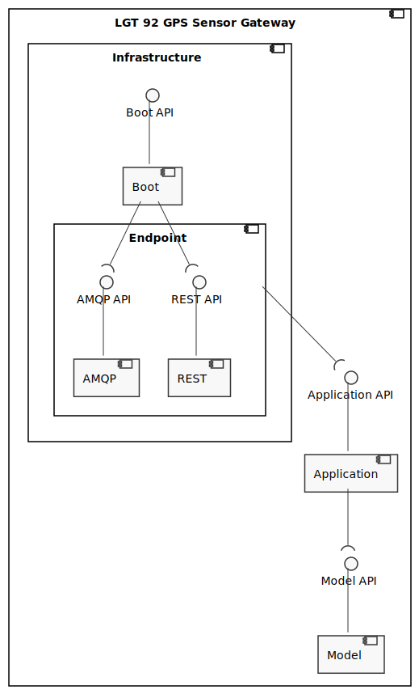

# Docs

This document aggregates all important info and documentation about location tracking.
It's intended mostly for developers and stakeholders.

## Functional Requirements

This section defines the functionalities and operations that the system supports.

### Actors

The system actors are:

- **Data Admin**: The Data Admin functions are analyzing the gathered information as he wishes;

### Use cases

| Use Cases | Description                                                                |
| --------- | -------------------------------------------------------------------------- |
| **UC01**  | As the data admin I want to see the live information for all device        |
| **UC02**  | As the data admin I want to see the live information for a specific device |

## Architecture

This section represents the architecture from different views and levels of abstraction (following the c4 and 4+1 models).

### Logical View - System Level

Logical View of the system and it's interactions with external systems and actors.


### Logical View - Container Level

Logical View of the containers that constitute the system and it's interactions.


The system is composed by the following containers:

- **Location Tracking Frontend**: Frontend that displays live information in a map;
- **Location Tracking Backend**: Backend that sends live information to the frontend;
- **Message Broker**: Container responsible for routing messages/events sent by the containers;
- **LGT 92 GPS Sensor Processor**: Container responsible for transforming the received data (LGT 92 GPS Sensor Data) into something that the system understands (GPS Sensor Data);
- **LGT 92 GPS Sensor Gateway**: Container responsible for receiving data (LGT 92 GPS Sensor Data) from the outside and propagate it in the system.

### Process View - Container Level

Process view of several UCs to display the system flow.

#### UC01 Process View - Container Level

```TODO```

Subscription made from UI:


Information updated from the received event:


#### UC02 Process View - Container Level

The flow is the same as UC01 - [info](#UC01-Process-View---Container-Level)

### Logical View - Component Level

Logical View of each container's component and it's interactions with other components.

#### Location Tracking Frontend

Currently the adopted architecture has, as reference architecture, the [Onion Architecture](https://jeffreypalermo.com/2008/07/the-onion-architecture-part-1/).
The following diagram describes it from a logical view.


#### Tracking Devices Backend

Currently the adopted architecture has, as reference architecture, the [Onion Architecture](https://jeffreypalermo.com/2008/07/the-onion-architecture-part-1/).
The following diagram describes it from a logical view.


#### LGT 92 GPS Sensor Processor

Currently the adopted architecture has, as reference architecture, the [Onion Architecture](https://jeffreypalermo.com/2008/07/the-onion-architecture-part-1/).
The following diagram describes it from a logical view.


#### LGT 92 GPS Sensor Gateway

Currently the adopted architecture has, as reference architecture, the [Onion Architecture](https://jeffreypalermo.com/2008/07/the-onion-architecture-part-1/).
The following diagram describes it from a logical view.



## API

This section will present the API that each backend service exposes.

### LGT 92 GPS Sensor Gateway API

This section will present every endpoint available in this service.
This information can be consulted [here](http://localhost:8080/swagger-ui/index.html) (this container must be running in dev mode).

#### Register LGT92 Sensor Data

**Endpoint**: POST to /lgt-92-sensors

This is the resource to point to, as an `http integration`, in helium console for LGT92 based sensors.

### Location Tracking Backend API

This section will present every endpoint available in this service.
Since the communication is made using GraphQL the only two endpoints are `/graphql` to request a subscription and `/subscriptions`.

#### Consult All GPS sensors live Data

**Endpoint**: `/graphql`

**Subscription**:

``` graphql

subscription {
  locations() {
    dataId
    deviceId
    reportedAt
    data {
        longitude
        latitude
    }
  }
}

```

This is the resource used to subscribe to changes in the gps location of all sensors registered in the network.

#### Consult a Specific GPS Sensor live data

**Endpoint**: `/graphql`

**Subscription**:

``` graphql

subscription {
  location(deviceId: "XXX") {
    dataId
    deviceId
    reportedAt
    data {
        longitude
        latitude
    }
  }
}

```

This is the resource used to subscribe to changes in the gps location of a specific sensor registered in the network.
