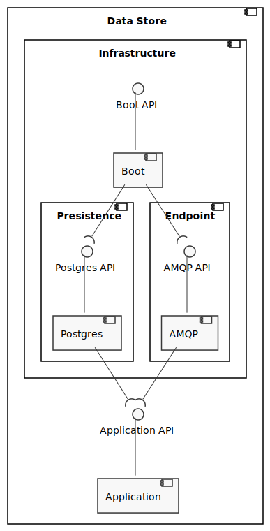

# Docs

This document aggregates all important info and documentation about location tracking.
It's intended mostly for developers and stakeholders.

## Functional Requirements

This section defines the functionalities and operations that the system supports.

### Actors

The system actors are:

- **Data Admin**: The Data Admin functions are analyzing and mutating the gathered information as he wishes;

### Use cases

| Use Cases | Description                                                                               |
| --------- | ----------------------------------------------------------------------------------------- |
| **UC01**  | As the data admin I want to see the live information for all devices                      |
| **UC02**  | As the data admin I want to see the live information for a specific device                |
| **UC03**  | As the data admin I want to define how to process data of a certain device type           |
| **UC04**  | As the data admin I want to see the transformations registered for all device types       |
| **UC05**  | As the data admin I want to delete a transformation i've added for a specific device type |
| **UC06**  | As the data admin I want to enhance the information provided by a device                  |
| **UC07**  | As the data admin I want to see the information i've added to each device                 |
| **UC08**  | As the data admin I want to delete information i've added about a specific device         |

## Architecture

This section represents the architecture from different views and levels of abstraction (following the c4 and 4+1 models).

### Logical View - System Level

Logical View of the system and it's interactions with external systems and actors.


### Logical View - Container Level

Logical View of the containers that constitute the system and it's interactions.


The system is composed by the following containers:

- **Location Tracking Frontend**: Frontend that displays live information in a map;
- **Location Tracking Backend**: Backend that sends live information to the frontend;
- **Device Records Frontend**: Frontend that allows the data admin to add, change and see information about a specific device;
- **Device Records Master Backend**: Backend that stores device data (records) and notifies slaves about changes to this data;
- **Device Records Slave Backend**: Backend that changes the data that goes trough him by adding specific device information;
- **Device Records Database**: Database that records information about each device;
- **Message Broker**: Container responsible for routing messages/events sent by the containers;
- **LGT 92 GPS Sensor Processor**: Container responsible for transforming the received data (LGT 92 GPS Sensor Data) into something that the system understands (GPS Sensor Data);
- **LGT 92 GPS Sensor Gateway**: Container responsible for receiving data (LGT 92 GPS Sensor Data) from the outside and propagate it in the system;
- **Data Relayer**: Container responsible for proxying sensor data requests to the assigned Sensor Gateway.

### Process View - Container Level

Process view of several UCs to display the system flow.

#### System Communication Process View - Container Level

**Description**: Once the environment is started containers subscribe to events in other containers. Some times containers may subscribe to new events or unsubscribe from old ones.


#### UC01 Process View - Container Level

**Description**: As the data admin I want to see the live information for all device.

Information updated from the received event:


#### UC02 Process View - Container Level

**Description**: As the data admin I want to see the live information for a specific device.

Information updated from the received event:


This flow is almost the same as the UC01, the only difference is that in this one a filter is applied to send only the requested data.

#### UC03 Process View - Container Level

**Description**: As the data admin I want to define how to process data of a certain device type.


#### UC04 Process View - Container Level

**Description**: As the data admin I want to see the transformations registered for all device types.


#### UC05 Process View - Container Level

**Description**: As the data admin I want to delete a transformation i've added for a specific device type.


#### UC06 Process View - Container Level

**Description**: As the data admin I want to enhance the information provided by a device.


#### UC07 Process View - Container Level

**Description**: As the data admin I want to see the information i've added to each device.


#### UC08 Process View - Container Level

**Description**: As the data admin I want to delete information i've added about a specific device.


### Logical View - Component Level

Logical View of each container's component and it's interactions with other components.

#### Location Tracking Frontend

Currently the adopted architecture has, as reference architecture, the [Onion Architecture](https://jeffreypalermo.com/2008/07/the-onion-architecture-part-1/).
The following diagram describes it from a logical view.


#### Tracking Devices Backend

Currently the adopted architecture has, as reference architecture, the [Onion Architecture](https://jeffreypalermo.com/2008/07/the-onion-architecture-part-1/).
The following diagram describes it from a logical view.


#### Device Records Frontend

Currently the adopted architecture has, as reference architecture, the [Onion Architecture](https://jeffreypalermo.com/2008/07/the-onion-architecture-part-1/).
The following diagram describes it from a logical view.


#### Device Records Master Backend

Currently the adopted architecture has, as reference architecture, the [Onion Architecture](https://jeffreypalermo.com/2008/07/the-onion-architecture-part-1/).
The following diagram describes it from a logical view.


#### Device Records Slave Backend

Currently the adopted architecture has, as reference architecture, the [Onion Architecture](https://jeffreypalermo.com/2008/07/the-onion-architecture-part-1/).
The following diagram describes it from a logical view.


#### Data Processor Slave Backend

Currently the adopted architecture has, as reference architecture, the [Onion Architecture](https://jeffreypalermo.com/2008/07/the-onion-architecture-part-1/).
The following diagram describes it from a logical view.


#### Data Processor Master Backend

Currently the adopted architecture has, as reference architecture, the [Onion Architecture](https://jeffreypalermo.com/2008/07/the-onion-architecture-part-1/).
The following diagram describes it from a logical view.


#### Data Processor Frontend

Currently the adopted architecture has, as reference architecture, the [Onion Architecture](https://jeffreypalermo.com/2008/07/the-onion-architecture-part-1/).
The following diagram describes it from a logical view.


#### Static Data Gateway

Currently the adopted architecture has, as reference architecture, the [Onion Architecture](https://jeffreypalermo.com/2008/07/the-onion-architecture-part-1/).
The following diagram describes it from a logical view.


#### Dynamic Data Gateway

Currently the adopted architecture has, as reference architecture, the [Onion Architecture](https://jeffreypalermo.com/2008/07/the-onion-architecture-part-1/).
The following diagram describes it from a logical view.


#### Data Store

Currently the adopted architecture has, as reference architecture, the [Onion Architecture](https://jeffreypalermo.com/2008/07/the-onion-architecture-part-1/).
The following diagram describes it from a logical view.



#### Chrono Data Store

Currently the adopted architecture has, as reference architecture, the [Onion Architecture](https://jeffreypalermo.com/2008/07/the-onion-architecture-part-1/).
The following diagram describes it from a logical view.


## API

This section will present the API that each backend service exposes.

### Data Gateway API

This section will present every endpoint available in this service.
This information can be consulted [here](http://localhost:8080/swagger-ui/index.html) (this container must be running in dev mode).
The **endpoint** to register new sensor data is `/sensor-data/{infoType}/{sensorType}`.
In production this endpoint can't be accessed, instead requests must be made to **Data Relayer**.

### Data Gateway

**Endpoint**: POST to `/sensor-data/{infoType}/{sensorType}`

**Path Variables**:

- **infoType**: `decoded` or `encoded`
- **sensorType**: any string that represents a sensor type (this will later be correlated with the sensor type configured with the data processor)

**Data Example**:

``` json
{
  "app_eui": "16217534746BD1D3",
  "decoded": {
    "payload": {
      "ALARM_status": false,
      "Accuracy": 3,
      "Altitude": 0,
      "BatV": 3.067,
      "FW": 153,
      "LON": "ON",
      "Latitude": 38.750244,
      "Longitude": -9.229148,
      "MD": "Disable",
      "Pitch": 0,
      "Roll": 0
    },
    "status": "success"
  },
  "dev_eui": "A84041CB91826E2F",
  "devaddr": "06000048",
  "downlink_url": "https://console.helium.com/api/v1/down/806c3543-450d-4d34-9948-582d130a38d2/ekQ508Ijd1Ip8L2nM6JjRBmOxs2luTz6/1194ea60-9a40-447a-b535-affba26da111",
  "fcnt": 188,
  "hotspots": [
    {
      "channel": 2,
      "frequency": 868.5,
      "id": "11Weepe1gHxjcaSq8cmh2QE8a9GxssEPXgbVifRvyNkprWc83BJ",
      "lat": 38.75500733680766,
      "long": -9.241637744431221,
      "name": "modern-gauze-rattlesnake",
      "reported_at": 1616349557723,
      "rssi": -113.0,
      "snr": -14.800000190734863,
      "spreading": "SF12BW125",
      "status": "success"
    }
  ],
  "id": "1194ea60-9a40-447a-b535-affba26ea111",
  "metadata": {
    "adr_allowed": false,
    "labels": [
      {
        "id": "036650d9-fb6c-48f3-99df-55773d816a5e",
        "name": "LGT_Decoder",
        "organization_id": "4004095e-8a2c-46a5-b9ef-7dbc4dbb1258"
      },
      {
        "id": "303896f0-8799-4328-a6fc-685c541b9cad",
        "name": "Cargo",
        "organization_id": "4004095e-8a2c-46a5-b9ef-7dbc4dbb1258"
      },
      {
        "id": "cac06b4e-b6fb-41d5-8861-ec836d2c8de0",
        "name": "IntegrationTest",
        "organization_id": "4004095e-8a2c-46a5-b9ef-7dbc4dbb1258"
      },
      {
        "id": "f5f80b55-f41b-41af-9e70-f7be1c5df928",
        "name": "Domus",
        "organization_id": "4004095e-8a2c-46a5-b9ef-7dbc4dbb1258"
      }
    ],
    "multi_buy": 1,
    "organization_id": "4004095e-8a2c-46a5-b9ef-7dbc4dbb1258"
  },
  "name": "Sharespot_Fernao #4",
  "payload": "Ak9IJP9zLKQL+yM=",
  "payload_size": 11,
  "port": 2,
  "reported_at": 1616349557723,
  "uuid": "979abd51-e754-4b02-a405-41e5c41c4b89"
}
```

This is the resource to point to, as an `http integration`, in helium console for sensor data.

### Data Processor Master Backend API

This section will present every endpoint available in this service.
Since the communication is made using GraphQL, and there is no `subscriptions` the only endpoint is `/graphql`.

#### Index a Data Transformation (new or updated transformation)

``` graphql
mutation index($transformation: DataTransformationInput){
  index(transformation: $transformation){
    data{
      type
    }
    entries{
      oldPath
      newPath
    }
  }
}
```

This is the resource used to index a new or edited data transformation to the database and cache.

#### Consult all Data Transformations

``` graphql
query transformation{
  transformation{
    data{
      type
    }
    entries{
      oldPath
      newPath
    }
  }
}
```

This is the resource used to query all data transformations in the database.

#### Erase a Data Transformation

``` graphql
mutation delete($type: DataTypeInput){
  delete(type: $type){
    type
  }
}
```

This is the resource used to remove a data transformation from the cache and database.

### Device Records Master Backend API

This section will present every endpoint available in this service.
Since the communication is made using GraphQL, and there is no `subscriptions` the only endpoint is `/graphql`.

#### Index a Device Record (new or updated record)

``` graphql
mutation index($records: DeviceRecordsInput){
  index(records: $records){
    device{
      id
      name
    }
    entries{
      label
      content
      type
    }
  }
}
```

This is the resource used to index a new or edited device record to the database and cache.

#### Consult all Device Records

``` graphql
query deviceRecords{
  deviceRecords{
    device{
      id
      name
    }
    entries{
      label
      content
      type
    }
  }
}
```

This is the resource used to query all device records in the database.

#### Erase a Device Record

``` graphql
mutation delete($device: DeviceInput){
  delete(device: $device){
    id
    name
  }
}
```

This is the resource used to remove a device record from the cache and database.

### Location Tracking Backend API

This section will present every endpoint available in this service.
Since the communication is made using GraphQL the only two endpoints are `/graphql` to request a subscription and `/subscriptions`.

#### Consult All GPS sensors live Data

**Endpoint**: `/graphql`

**Query**:

``` graphql
subscription {
  locations() {
    dataId
    device{
      id
      name
    }
    reportedAt
    data{
      gps{
       longitude
       latitude
      }
    }
    record{
      label
      content
    }
  }
}
```

This is the resource used to subscribe to changes in the gps location of all sensors registered in the network.

#### Consult a Specific GPS Sensor live data

**Endpoint**: `/graphql`

**Query**:

``` graphql
subscription {
  location(deviceId: "XXX") {
    dataId
    device{
      id
      name
    }
    reportedAt
    data{
      gps{
       longitude
       latitude
      }
    }
    record{
      label
      content
    }
  }
}

```

This is the resource used to subscribe to changes in the gps location of a specific sensor registered in the network.

#### Consult GPS Sensors that match the content sent

``` graphql
subscription {
  locationByContent(content: "XXX") {
    dataId
    device{
      id
      name
    }
    reportedAt
    data{
      gps{
       longitude
       latitude
      }
    }
    record{
      label
      content
    }
  }
}
```

This is the resource used to subscribe to changes in the gps location of any sensor that has content matching the "content" sent.

## Data Flow Diagram

On a Higher level sensor data flows in the system as represented in here:


