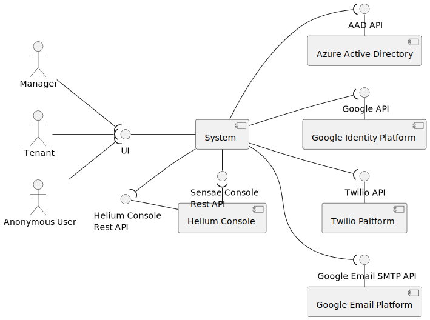
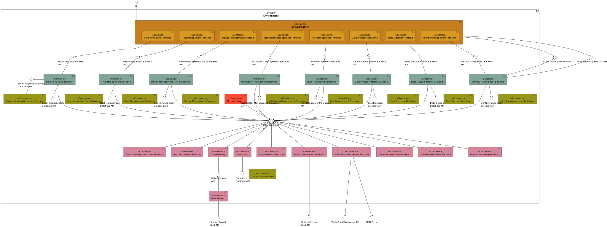
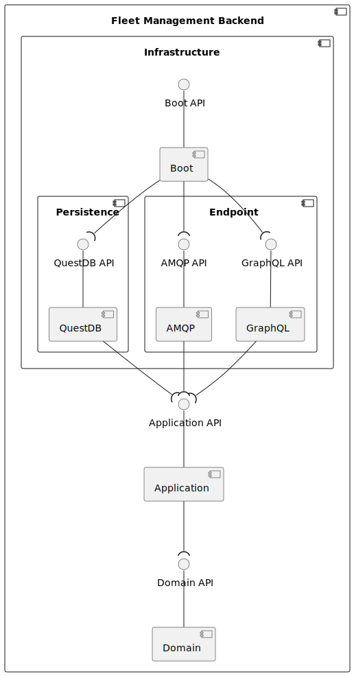
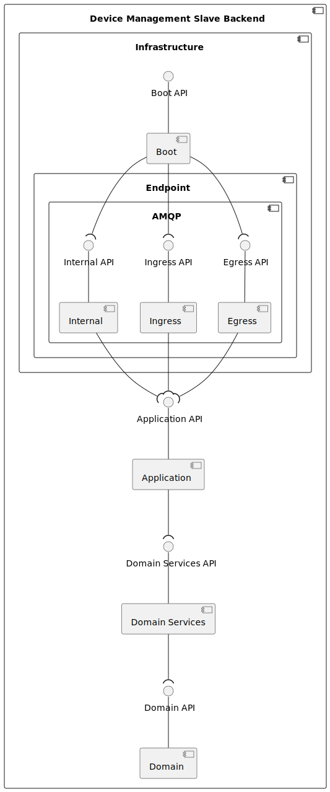
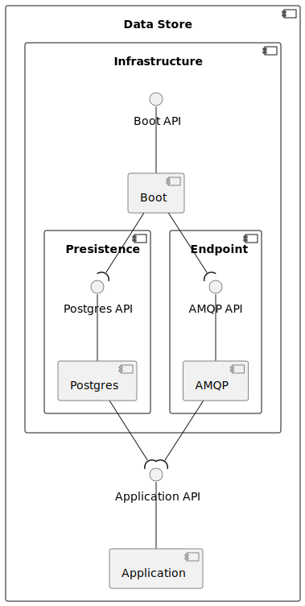
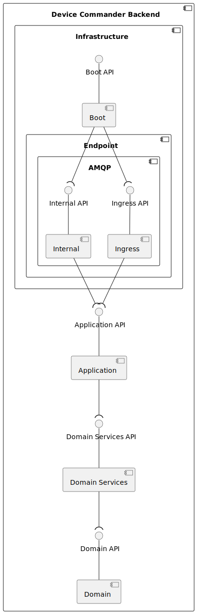
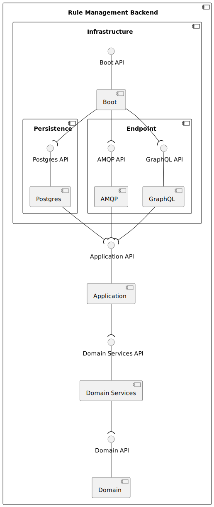
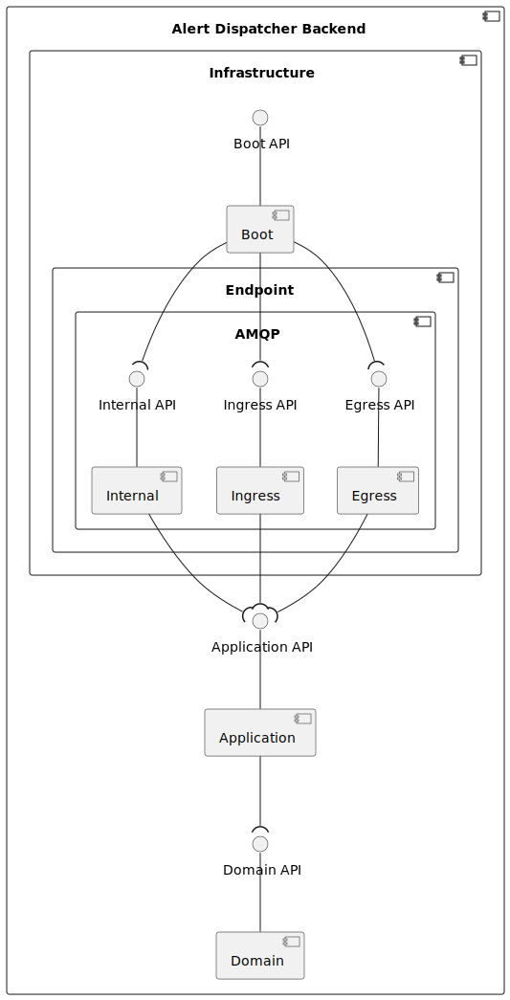
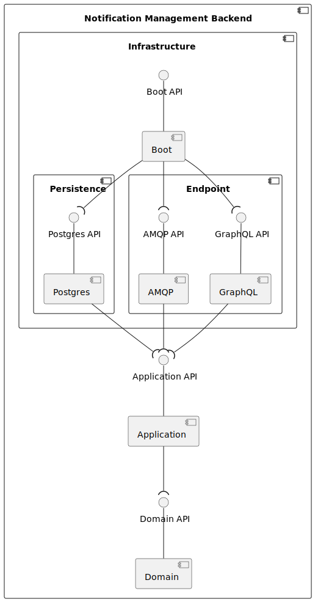
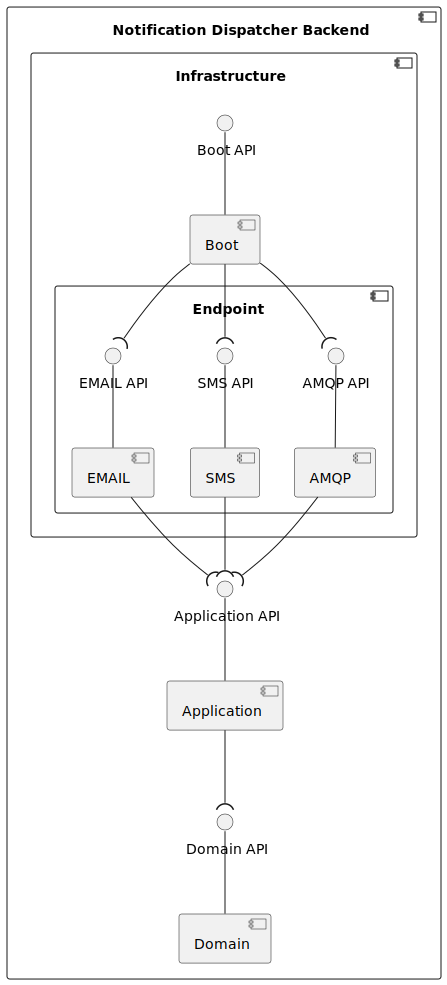

# Architecture

This section represents the system architecture from different views and levels of abstraction (following the c4 and 4+1 models) according to the latest version of the system.

Current version:

- `system` : `0.10.0`

## Logical View - System Level

Logical View of the system and it's interactions with external systems and actors.

## Logical View - Container Level

Logical View of the containers that constitute the system and it's interactions.

The system is composed by the following containers:

- **UI Aggregator**: Container responsible for loading other frontend;
- **Fleet Management Frontend**: Frontend that displays live information in a map;
- **Fleet Management Backend**: Backend that receives correct GPS data, stores it and sends it as live information to the frontend;
- **Fleet Management Database**: Database that stores GPS data received from **Fleet Management Backend**;
- **Smart Irrigation Frontend**: Frontend that displays sensor live information in a map, gardening areas and valve status;
- **Smart Irrigation Backend**: Backend that receives correct park/stove/valve sensor data, stores it and sends it as live information to the frontend. This backend also manages gardening areas;
- **Smart Irrigation Business Database**: Database that stores gardening areas and basic device info;
- **Smart Irrigation Data Database**: Database that stores sensor data;
- **Device Management Frontend**: Frontend that allows the data admin to add, change and see information about a specific device;
- **Device Management Master Backend**: Backend that stores device data and notifies slaves about changes to this data;
- **Device Management Slave Backend**: Backend that changes the data that goes trough him by adding specific device information;
- **Device Management Database**: Database that records information about each device;
- **Device Validator Backend**: Backend that verifies if the data that goes trough him is valid, (e.g. gps data does not point to the sea, temperature isn't 500 ºC);
- **Message Broker**: Container responsible for routing messages/events sent by the containers;
- **Data Processor Frontend**: Frontend that allows the data admin to add, change and see information about a device transformation;
- **Data Processor Slave Backend**: Backend responsible for transforming the received data into something that the system understands (though property mapping);
- **Data Processor Master Backend**: Backend responsible for notifying slaves that new data transformation are available;
- **Data Processor Database**: Database that records information about how each device type can be transformed (mapping);
- **Data Decoder Frontend**: Frontend that allows the data admin to add, change and see the content of script used to decode a device data (though scripting);
- **Data Decoder Slave Backend**: Backend responsible for transforming the received data into something that the system understands though scripts;
- **Data Decoder Master Backend**: Backend responsible for notifying slaves that new data decoders are available;
- **Data Decoder Database**: Database that records information about how each device type can be decoded (scripts);
- **Data Gateway**: Backend responsible for proxying sensor data requests to the assigned **Data Processor Slave** or **Data Decoder Slave**;
- **Identity Management Frontend**: Frontend responsible for requesting user identification (to Azure active directory), provide access to the environment and manage identity/access/ownership issues inside the environment;
- **Identity Management Backend**: Backend responsible for validating user credentials and handle device ownership, domain/company permissions and users domain;
- **Device Ownership Backend**: Backend that changes the data that goes trough him by adding device ownership information;
- **Identity Management Database**: Database that records information about the structure of the organization;
- **Data Store**: Backend responsible for recording data in the defined data flow stage, e.g. record every invalid gps data, or, record every data that goes out of data decoder slave;
- **Data Store Database**: Database that records information given by **Data Store**, has the purpose of acting like a Data Lake;
- **Device Commander Backend**: Backend that receives internal requests to execute actions and dispatch them to Helium as downlinks;
- **Data Relayer**: Backend responsible for routing data to **Data Gateway**.
- **Rule Management Frontend**: Frontend responsible for interacting with managers. Users can see, create, edit and delete rule scenarios using the UI.
- **Rule Management Backend**: Backend responsible for verifying that the submitted rule scenarios can be compiled, if so it notifies that a rule was updated, deleted or added.
- **Alert Dispatcher Backend**: Backend that is responsible for executing rules when new sensor data arrives to it from the message broker. When facts match a rule condition alarms are produced. This alarms are send to the message broker so that others are notified about them.
- **Rule Management Database**: Database that stores all rules.
- **Notification Management Frontend**: Frontend responsible for interacting with tenants. Users can see and subscribe to different types of notifications in the UI.
- **Notification Management Backend**: Backend responsible for serving new/old notifications and manage each tenant subscription configuration.
- **Notification Dispatcher Backend**: Backend that is responsible for sending notifications to subscribed tenants via email or sms.
- **Notification Management Database**: Database that stores all notifications and topics that each tenant subscribed to.

In the following diagram a better idea of what each container responsibilities are is presented:

- **Green**: logical databases;
- **Pink**: containers involved in the data packet flow;
- **Blue**: containers that handle information that is added to data packets during the flow;
- **Yellow**: Frontends that display information;
- **Orange**: Frontend that provides all other frontends;
- **Red**: Message Broker;

## Process View - Container Level

Process view of several UCs to display the system flow.

### System Communication Process View - Container Level

**Description**: Once the environment is started containers subscribe to events. Some times containers may subscribe to new events or unsubscribe from old ones.

### UC01 Process View - Container Level

**Description**: As a tenant I want to see the live information for all my devices.

Information updated from the received event:

### UC08 Process View - Container Level

**Description**: As a tenant I want to define how to decode data of a certain device type

Information updated from the received event:

This flow is almost the same as the UC01, the only difference is that in this one a filter is applied to send only the requested data.

### UC10 Process View - Container Level

**Description**: As a tenant I want to delete a script i've added for a specific device type.

### UC13 Process View - Container Level

**Description**: As a manager I want to see the information i've added to each device.

## Logical View - Component Level

Logical View of each container's component and it's interactions with other components.
Currently the adopted architecture for most container has, as reference architecture, the [Onion Architecture](https://jeffreypalermo.com/2008/07/the-onion-architecture-part-1/).

### Fleet Management Frontend

The following diagram describes it from a logical view.

### Fleet Management Backend

The following diagram describes it from a logical view.

### Smart Irrigation Frontend

The following diagram describes it from a logical view.

### Smart Irrigation Backend

The following diagram describes it from a logical view.

### Device Management Frontend

The following diagram describes it from a logical view.

### Device Management Master Backend

The following diagram describes it from a logical view.

### Device Management Slave Backend

The following diagram describes it from a logical view.

### Data Processor Slave Backend

The following diagram describes it from a logical view.

### Data Processor Master Backend

The following diagram describes it from a logical view.

### Data Processor Frontend

The following diagram describes it from a logical view.

### Data Decoder Slave Backend

The following diagram describes it from a logical view.

### Data Decoder Master Backend

The following diagram describes it from a logical view.

### Data Decoder Frontend

The following diagram describes it from a logical view.

### Device Ownership Backend

The following diagram describes it from a logical view.

### Identity Management Master Backend

The following diagram describes it from a logical view.

### Identity Management Frontend

The following diagram describes it from a logical view.

### Data Gateway

The following diagram describes it from a logical view.

### Data Store

The following diagram describes it from a logical view.

### Data Validator

The following diagram describes it from a logical view.

### Device Commander

The following diagram describes it from a logical view.

### Rule Management Frontend

The following diagram describes it from a logical view.

### Rule Management Backend

The following diagram describes it from a logical view.

### Alert Dispatcher Backend

The following diagram describes it from a logical view.

### Notification Management Frontend

The following diagram describes it from a logical view.

### Notification Management Backend

The following diagram describes it from a logical view.

### Notification Dispatcher Backend

The following diagram describes it from a logical view.

## Further Discussion

As always, changes/improvements to this page and the system architecture is expected.
