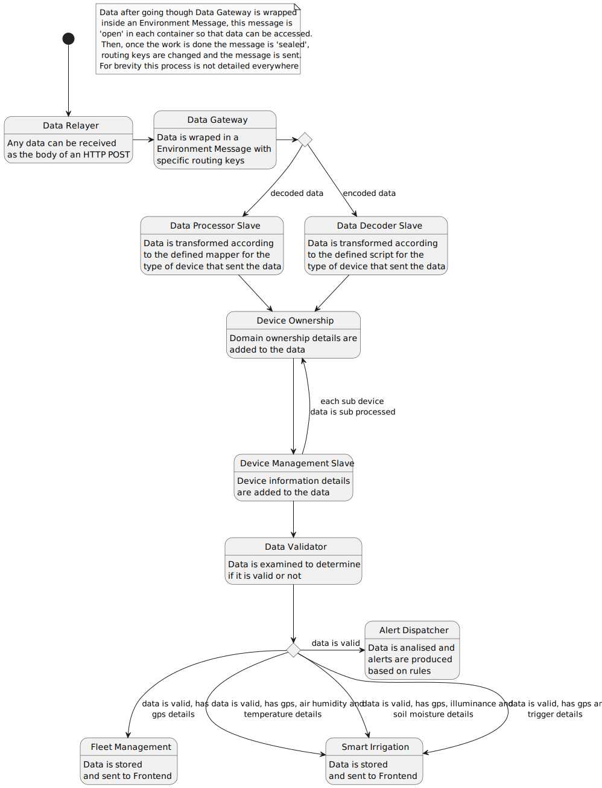

# Data Flow

This section represents how data flows according to the latest version of the system.

Current version:

- `system` : `0.6.0`

## Description

This system leverages RabbitMQ functionalities to route data though it.

Each container subscribes to specific Routing Keys, currently these are the available ones:

- **Container Type**: e.g. Data Gateway;
- **`iot-core` Version**: used by the container (to ensure compatibility across the system);
- **data**;
- **Sensor Data Information Type**: `encoded`, `decoded` or `processed`
- **Sensor Type**: e.g. `lgt92`;
- **Permissions**: related to domain ownership;
- **Records**: related to device records;
- **GPS Data**: if the sensor data contains GPS Data;
- **Temperature Data**: if the sensor data contains Temperature Data;
- **AQI Data**: if the sensor data contains AQI Data;
- **Humidity Data**: if the sensor data contains Humidity Data;
- **Motion Status Data**: if the sensor data contains Motion Status Data;
- **Velocity Data**: if the sensor data contains Velocity Data;
- **Pressure Data**: if the sensor data contains Pressure Data;
- **Soil Moisture Data**: if the sensor data contains Soil Moisture Data;
- **Illuminance Data**: if the sensor data contains Illuminance Data;
- **Alarm Data**: if the sensor data contains Alarm Data;
- **Battery Data**: if the sensor data contains Battery Data;

This properties are further explained in the [model](../model/README.md) section.

Each sensor data received is wrapped in a `Message` with an unique id to prevent re processing data due to unexpected routing paths, a Time to Live parameter set to 10 that decreases as the data packet moves thought the containers and the routing keys used to route the message.

As an example this are the routing key of a sensor data that was accepted by `fleet management`:

`device_records.0.1.13.data.processed.lgt92.default.with_permissions.with_records.correct.with_gps_data.without_temperature_data.without_aqi_data.without_humidity_data.without_motion_data.without_velocity_data.without_pressure_data.without_soil_moisture_data.without_illuminance_data.without_alarm_data.without_battery_data.#`

On a Higher level sensor data flows in the system as represented in here:

This diagram does not account for invalid data or possible errors that occur during the process.

## Further Discussion

As always, changes/improvements to this page and the data flow are expected.
