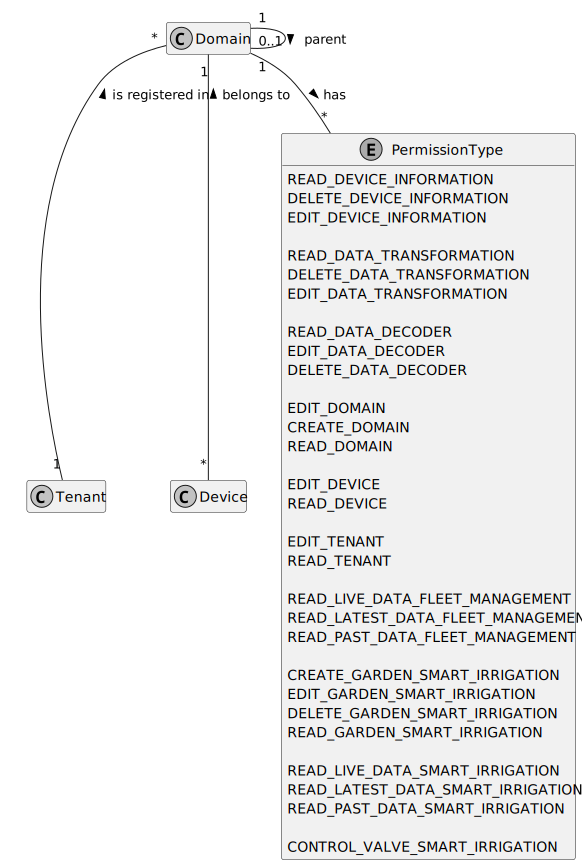
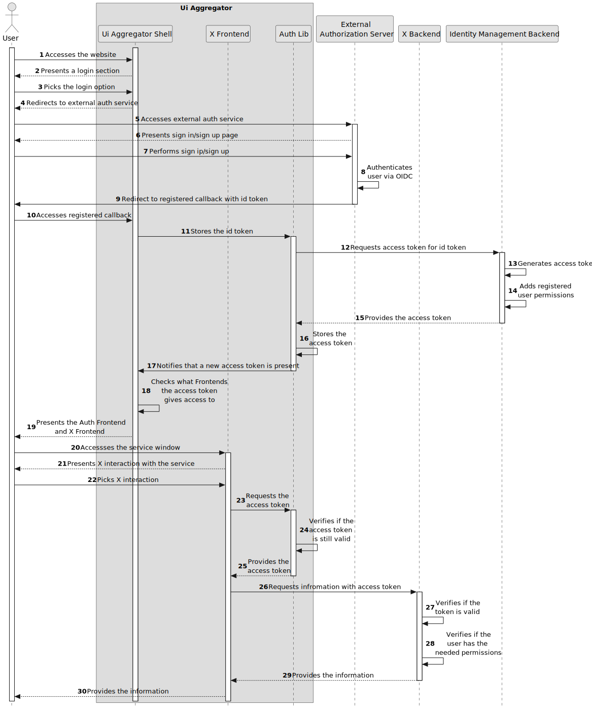

# Identity Management

This document describes how `identity management` functions inside the system, according to the latest version.

Current version:

- `system` : `0.10.0`

## Introduction

Identity Management is concerned with identifying users, defining their permissions and what devices they own.
To ease the management of all this for each user a forth concept is introduced: domain.

The following diagram describes how this concepts interact:

A Domain represents a department in a hierarchical organization structure. An organization is composed of several domains in a tree like format. Any "organization" is composed of the following static domains:

- lvl 1 - `root`
- lvl 2 - `root/unallocated` `root/{{others}}`
- lvl 3 - `root/{{others}}/unallocated` `root/{{others}}/{{sub-others}}`

Rules:

- `root` domain has full control over everything.
- `root/unallocated` has access to nothing (stores people that have not been added to any company)
- `root/public` is a public domain that anyone, even anonymous users belong to, any device/permission can be added to this domain
- `root/{{others}}/unallocated` stores people that have not been assigned to any organization department and don't have access to anything.
- new people are sent to the `root/unallocated` domain and then are moved to `root/{{others}}/unallocated` depending on the organization that they belong.
- new devices are sent to the `root` domain and then moved to `root/{{others}}` depending on the organization that they belong to.
- a domain has access to all devices in him and in his subdomains.
- a domain can only inherit his parent domain permissions.
- a tenant has all the domain permissions that he is registered in.
- a tenant can only see the devices that the domains he is registered in have access to.

## Authentication

Authentication is ensured by an external identity provider, microsoft or google.
For a user to preform any action in the system he needs to log in the chosen provider.
An `access token` is generated and requested in each endpoint to ensure that the user is authenticated.

A user can also access the platform as an anonymous user, this user has access to anything in the `public domain` only.

## Authorization

Authorization is ensured by requiring an `access token` in each backend endpoint.
This `access token` is generate by the system after log in and stores information about the user permissions, identity and domains.

If the tenant doesn't have the needed permissions to perform an action in the system an authorization error is sent back.

An `access token` is valid for 30 minutes, if during this time the tenant permissions change the tenant must authenticate back in the system to be affected by this change.

## Design Alternatives discussed

Here some alternative related to the identity flow are described.
The fourth alternative was the chosen one.

### 1 - Internal Authorization Server

By creating an Internal Authorization Server we could have a normal and controlled flow in the environment.

The following diagram presents the normal environment flow for this alternative.

But there would be a risk related to data breaches and anyone would need to register in the environment. For this reason this alternative was discarded.

### 2 - External Authorization Server

By using an external Authorization Server there would be no need to store user credentials.

The following diagram presents the normal environment flow for this alternative.

This approach would create a strong dependency to the auth service used.
Some of this services are:

- [Auth0](https://auth0.com/b2c-customer-identity-management)
- [Google](https://cloud.google.com/identity-platform/)
- [Okta](https://www.okta.com/solutions/secure-ciam/)
- [Amazon Cognito](https://aws.amazon.com/cognito/)
- [Azure Active Directory B2C](https://azure.microsoft.com/en-us/services/active-directory/external-identities/b2c/)

The dependency is even more severe since all user permissions would have to be managed in this auth service.

The platform `Auth0` was tested and it is capable of registering user roles and permissions according to the requirements.

The dependency created would force the environment created to always be coupled to the service no matter what. For this reason this alternative was removed.

### 3 - External Authorization Server with Internal Roles Server

By using an external Authorization Server there would be no need to store user credentials.

The following diagram presents the normal environment flow for this alternative.

This approach would create a dependency to the auth service used and presented in the second alternative.

The dependency to the auth service is less severe compared with the second alternative since all permissions would be managed internally.
This approach would require any authorized request to query the `identity management backend` for the user permissions, and therefore linger down the performance of the environment.

### 4 - External Authorization Server with Internal Oauth2 Server

By using an external Authorization Server there would be no need to store user credentials.

The following diagram presents the normal environment flow for this alternative.

This approach would create a dependency to the auth service used and presented in the second alternative.

The dependency to the auth service is less severe compared with the second alternative since all permissions would be managed internally.
This approach would require the system to create (and possibly refresh) `access token`s based on the `id token` received.

Contrary to the alternative 3 it would not create excessive pressure in some container.

## Further Discussion

As always, changes/improvements to this page and `identity management`s behavior are expected.
