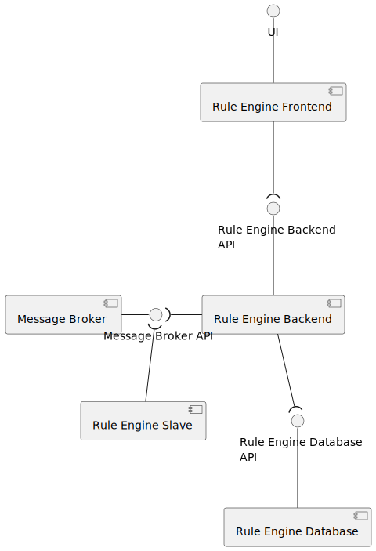

# Rules Engine

Current version:

- `iot-core` : `0.1.18`
- `system` : `0.9.0`

## Introduction

A rule engine has the responsibility to execute rules against incoming data.

In this project a rule can be something like:

1. If valve X is open for more than 10 minutes, close it;
2. If temperature sensors in X place reported an average of 40 ºC for the last 10 minutes, sound the alarm;

Rules can be categorized with:

- Conditions;
- Actions;
- Facts;

Facts are inserted in a rule engine.
If a fact or group of facts match a condition, an action is triggered.

The rule engine, is tailored to the `manager` or `developers` and not for the final clients since it can be hard to create meaningfully rules without side effects.

The alarms dispatched are collected and then sent by email, sms or web notification.

The alarms dispatched can be received by other services to preform actions based on the information collected. As an example, **Smart Irrigation** will close an open valve if it receives an alarm reporting that a valve is open for a long time.

## Technology

[Drools](https://www.drools.org/) is an open-source rule engine widely used in the industry. It has support for sliding windows of time, data streaming, integrates with `iot-core` package with ease since it is written in `java`, can be embedded in a server running java and supports dynamic loading rules at runtime.

Drools allows users to write and submit rules. As an example the following rule verifies if the inserted `data` belongs to Project #003, has a measure of type `PropertyName.TRIGGER` and it's `device` has not been inserted yet. When all this conditions match, a new `ValveDevice`, for the device that sent the data is inserted into Drools and an alarm is sent informing that a new valve has been created.

``` drl
rule "Create new valve device that belongs to Project #003"
    when
        data : SensorDataDTO(
            getSensorData().hasProperty(PropertyName.TRIGGER)
        )
        exists DeviceRecordEntryDTO(label == "Project" && content == "#003") from data.device.records
        not(ValveDevice(deviceId == data.device.id))
    then
        ValveDevice valve = new ValveDevice();
        valve.setDeviceId(data.device.id);
        insert(valve)
        dispatcher.publish(AlertBuilder.create()
                          .setCategory("new device")
                          .setSubCategory("valve")
                          .setLevel(AlertLevel.INFORMATION)
                          .setDescription("DeviceId: " + data.device.id)
                          .build());
end
```

## Rules

In order to create `rules` there are certain rules to follow:

- Rules must be written according to the drools syntax;
- `SensorDataDTO` is inserted in drools every time a new `valid` data is published in the system, `SensorDataDto` structure can be seen in the [model](../model/README.md) section;
- To send alerts/alarms based on matching rules, the `then` section must use the `dispatcher` class to send a newly created `Alarm`;
- An alarm is composed by:
  - `category`: main category of the alarm, e.g. _smartIrrigation_, _newDevice_, _fleetManagement_. This property can only have letters and numbers;
  - `subCategory`: sub category of the alarm, e.g. _drySoil_, _valveOpenForLengthyPeriod_. This property can only have letters and numbers;
  - `level`: severity level;
  - `description`: block of text with details, it can be anything;
  - `dataIds`: list of `datId` that are related to the alarm dispatch, e.g. `dataId` that recorded a low level of soil moisture;
  - `deviceIds`: list of `deviceIds` that are related to the alarm dispatch, e.g. `deviceId` of the valve that is open for more than 30 minutes;
  - `other`: other information related to the alarm dispatch, can be anything.
- An alarm will only be sent if at least the `category` and `sub category` parameters are set in the build;
- By default the severity level is `INFORMATION`, it can also have the following values (sorted by severity):
  - `WATCH`
  - `ADVISORY`
  - `WARNING`
  - `CRITICAL`
- In order for another service act upon a received alarm, that alarm has to be associated with a `DeviceId` (this association helps services like `Smart Irrigation` to know what Valve must be turned on or off), a `DataId` or `Other` (any info deemed important);
- If no `deviceIds` are given only the root tenant will have access to the alarm;
- A rule can import and create new classes/events when needed;
- A rule name can't be duplicated;
- A scenario name can't be duplicated;
- A scenario `package` should be unique to avoid duplicated class declarations and further errors.

To test new rules it is advised to set the severity to `INFORMATION` and wait for notifications to arrive to the UI.

Every time drools receives a new rule scenario all running facts are lost. To prevent some alarms from been lost, updates are only made at best every **30 minutes**.

## Architecture

The following diagram represents the idealized architecture:



- **Rule Management Frontend**: this container is responsible for interacting with managers. Users can see, create, edit and delete rule scenarios using the UI.
- **Rule Management Backend**: this container is responsible for verifying that the submitted rule scenarios can be compiled, if so it notifies that a rule was updated, deleted or added.
- **Alert Dispatcher**: this container is responsible for executing rules when new sensor data arrives to it from the message broker. When facts match a rule condition alarms are produced. This alarms are send to the message broker so that other containers are notified about them.
- **Rule Management Database**: this container is responsible for storing all rule scenarios.
- **Message Broker**: this container is responsible for sending new sensor data to **Alert Dispatcher** trough `sensor.topic`, send updates about rules to **Alert Dispatcher** trough `internal.topic`, let **Rule Management Backend** publish new updates about rules in `internal.topic` and let **Alert Dispatcher** publish new alerts in `alerts.topic`.

## Rules examples

Some [examples](assets) of possible rules are provided.

## Rule Scenarios in use

Currently this two rule scenarios are in use:

- P#001 - Aviário: [scenario](assets/Project#001/scenario.drl)
- P#002 - Estufa Shiitake: [scenario](assets/Project#002/scenario.drl)

## Further Discussion

As always, changes/improvements to the rule engine are expected.
