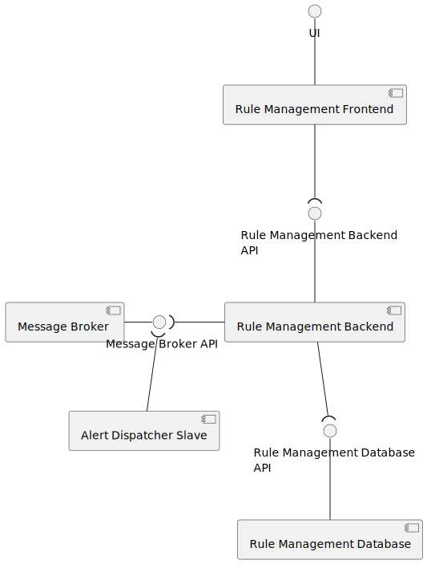

# Rules Engine

Current version:

- `iot-core` : `0.1.17`
- `system` : `0.8.0`

## Introduction

A rule engine has the responsibility to execute rules against incoming data.

In this project a rule can be something like:

1. If valve X is open for more than 10 minutes, close it;
2. If temperature sensors in X place reported an average of 40 ºC for the last 10 minutes, sound the alarm;

This rule can be categorized with:

- Conditions;
- Actions;
- Facts;

Facts are inserted in a rule engine.
If this facts match a condition, that condition's action is triggered.

The rule engine, is tailored to the `manager` or `developers` and not for the final clients since it can be hard to create meaningfully rules without side effects.

## Technology

[Drools](https://www.drools.org/) is an open-source rule engine widely used in the industry. It has support for sliding windows of time, data streaming, integrates with `iot-core` package with ease since it is written in `java`, can be embedded in a server running java and supports dynamic loading rules at runtime.

Drools allows users to write and submit rules. As an example the following rule verifies if the inserted `data` belongs to Project #003, has a measure of type `PropertyName.TRIGGER` and it's `device` has not been inserted yet. When all this conditions match, a new `ValveDevice`, for the device that sent the data is inserted into Drools and an alarm is sent informing that a new valve has been created.

``` drl
rule "Create new valve device if it belongs to Project #003 and is new"
    when
        data : ProcessedSensorDataDTO(
            getSensorData().hasProperty(PropertyName.TRIGGER)
        )
        exists DeviceRecordBasicEntryDTO(label == "Project" && content == "#003") from data.device.records.entry
        not(ValveDevice(deviceId == data.device.id))
    then
        ValveDevice valve = new ValveDevice();
        valve.setDeviceId(data.device.id);
        insert(valve)
        dispatcher.send(AlarmBuilder.create()
                          .setName("valve")
                          .setDescription("New Valve")
                          .setDeviceId(data.device.id)
                          .createAlarm());
end
```

## Rules

In order to create `rules` there are certain rules to follow:

- Rules must be written according to the drools syntax;
- `SensorDataDto` is inserted in drools every time a new `valid` data is published in the system, `SensorDataDto` structure can be seen in the [model](../model/README.md) section;
- To send alerts/alarms based on matching rules, the `then` section must use the `dispatcher` class to send a newly created `Alarm`;
- An alarm must have a `category`, a `description`, and a severity level, `INFORMATION`, `WARNING` and `CRITICAL`.
- An alarm can be associated with a `DeviceId` (this association helps applications like `Smart Irrigation` to know what Valve must be turned on or off), a `DataId` or `Other` (any info deemed important).
- A rule can import and create new classes/events when needed.
- A rule name can't be duplicated.
- A scenario name can't be duplicated.

To test new rules it is advised to set the severity to `INFORMATION` and wait for notifications to arrive to the UI.

Every time drools receives a new rule all running facts are lost. To prevent some alarms from been lost updates are only made at best every 30 minutes.

## Architecture

The following diagram represents the idealized architecture:



- **Rule Engine Frontend**: this container is responsible for interacting with managers. Users can see, create, edit and delete rules using the UI.
- **Rule Engine Backend**: this container is responsible for verifying that the submitted rules can be compiled, if so it notifies the slaves that a rule was updated, deleted or added.
- **Alert Dispatcher**: this container is responsible for executing rules when new sensor data arrives to it from the message broker. When facts match a rule condition alarms are produced. This alarms are send to the message broker so that other containers are notified about them.
- **Rule Engine Database**: this container is responsible for storing all rules.
- **Message Broker**: this container is responsible for sending new sensor data to **Rule Engine Slave** trough `sensor.topic`, send updates about rules to **Rule Engine Slave** trough `internal.topic`, let **Rule Engine Backend** publish new updates about rules in `internal.topic` and let **Rule Engine Slave** publish new alerts in `alerts.topic`.

## Rules examples

Some [examples](assets) of possible rules are provided.

## Further Discussion

As always, changes/improvements to the rule engine are expected.
