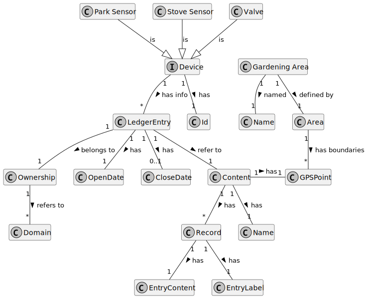

# Smart Irrigation

This section describes the **Smart Irrigation** service according to the latest version.

Current version:

- `system` : `0.9.0`

## Description

Business Domain:

## Internal System Inputs/Outputs

This service inputs are:

- **Sensor Topic**: valid data with `gps` and `trigger` readings (for valves);
- **Sensor Topic**: valid data with `gps`, `temperature` and `air humidity` readings (for stove sensors);
- **Sensor Topic**: valid data with `gps`, `illuminance` and `soil moisture` readings (for park sensors);

- **Alert Topic**: alerts with the category `smartIrrigation` and sub category `drySoil` (to open all valves in a garden);
- **Alert Topic**: alerts with the category `smartIrrigation` and sub category `valveOpenForLengthyPeriod` or `moistSoil` (to close all valves in a garden);

This service outputs are:

- **Command Topic**: command to close/open a single valve;

## Further Discussion

As always, changes/improvements to this page and `smart irrigation`s behavior are expected.
